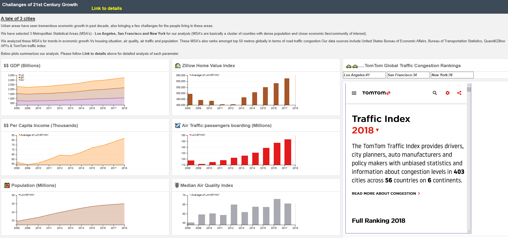

<h4><b><u> A tale of 3 cities</u></b></h4>
          
 Urban areas have seen tremendous economic growth in past decade, also bringing a few challanges for the people living in these areas.
  

          
 We have selected 3 Metropolitan Statistical Areas (MSA's) - <b>Los Angeles, San Francisco and New York</b> for our analysis (MSA's are basically a cluster of counties with dense population and closer economic ties/community of interest).
          
 We analyzed these  MSA's for trends in economic growth Vs housing situation, air quality, air traffic and population. These MSA's also ranks amongst top 50  metros globally in terms of road traffic congestion.Our data sources include United States Bureau of Economic Affairs, Bureau of Transportation Statistics, Quandl/Zillow API's & TomTom traffic index.

         
        
        
        
        
